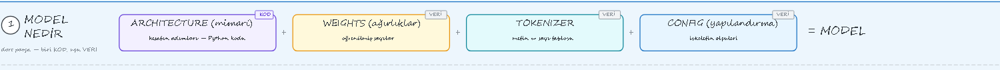
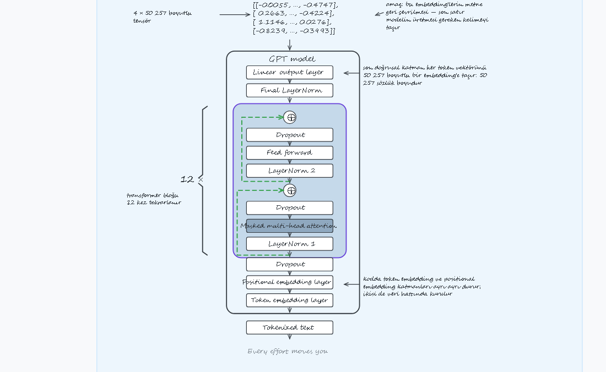

# Sıfırdan ChatGPT ve LLM
### Sezgiden Kodlamaya

> **🇬🇧 In English** — A Turkish-language course that builds a 124M-parameter GPT-2 from scratch
> in PyTorch, from the tokenizer up to instruction finetuning. Every concept is first built as
> intuition on a diagram, then written line by line in code. Everything runs in a single notebook
> on a free Kaggle GPU.

Bu seride amacımız önce **sezgiyi kurmak**, ardından **koda dökmek.**

Kavramları formüllere boğulmadan, şemalar ve sade bir mantıkla ele alıyoruz. Sonra GPT-2
mimarisini adım adım kendimiz kodluyoruz. Tokenizer'dan attention mekanizmasına kadar
parçaları birleştirdikten sonra:

- Küçük bir örnek üzerinden **eğitim döngüsünün ve kaybın** mantığını inceliyoruz.
- OpenAI'ın hazır **GPT-2 ağırlıklarını** kendi yazdığımız modele yüklüyoruz.
- Modeli **instruction finetuning** ile talimat takip eden bir asistana dönüştürüyoruz.

Tüm kodlar tek bir notebook'ta, Kaggle'ın ücretsiz GPU'sunda çalışacak şekilde hazırlandı.

**Sezgiden kodlamaya: kendi dil modelini yazma sürecine hoş geldin.**

---

## Ne inşa ediyoruz

  

Yukarıdaki her kutu bir ders. Seri bittiğinde hepsi senin yazdığın kod olacak.

| | |
| --- | --- |
| **Tokenizer** | BPE dahil, kendi yazdığın |
| **Attention** | tek başlıktan çok başlığa, maskesiyle birlikte |
| **GPT-2** | 12 blok · 768 boyut · 50 257 sözlük · 124 milyon parametre |
| **Ağırlıklar** | önce kendi eğittiğin, sonra karşılaştırma için OpenAI'ınki |
| **İki uzman** | bir konu sınıflandırıcı ve talimat izleyen bir asistan |

Hazır model indirmiyoruz. Klasördeki her parçayı kendimiz kuruyoruz.

## Nasıl çalıştırılır

Depoda tek bir defter var: **`FULL-SERIES.ipynb`**. Serinin bütün kodu içinde.

| Ortam | Ne yapmalısın |
| --- | --- |
| **Kaggle** ⭐ | Defteri yükle, hızlandırıcıyı GPU yap, *Run All*. Serinin sınandığı ortam bu. |
| **Colab** | Defteri aç, çalışma zamanını GPU yap, *Tümünü çalıştır*. |
| **Yerel** | Depoyu klonla, defteri kök dizinde aç. Veri yanında olduğu için indirme bile olmaz. |

Defter veriyi üç yerde arar: yanındaki `_data/` klasörü, Kaggle girdileri, son çare olarak
bu depo. Yani yalnız `.ipynb` dosyasını alıp Kaggle'a atsan da eksiksiz çalışır.

## Depoda ne var

| Yol | Ne |
| --- | --- |
| `FULL-SERIES.ipynb` | serinin bütün kodu, tek defter |
| `_data/how-words-work.txt` | ön eğitim korpusu |
| `_data/instruction-data.json` | talimat verisi, 1100 kayıt |
| `part-0-introduction/` | tanıtım videosunun anlatım haritası |

Anlatım haritaları **Excalidraw** dosyasıdır: sürükleyip bırakınca açılır, üstüne yazabilir,
kendi notlarını ekleyebilirsin. Her bölümün haritası, o bölümün videosu yayımlandıkça
buraya eklenir.

## Müfredat

**Bölüm 0 · Tanıtım**

0. Seri Tanıtımı: Model Nedir, Onu Ne Çalıştırır?

**Bölüm 1 · Büyük Resim**

1. Öğrenme, Dil Modeli, LLM ve ChatGPT: Büyük Resim

**Bölüm 2 · Veriden Tensöre**

2. Tokenizer'ı Yazıyoruz: Özel Token'lar ve BPE
3. Veri Hattı: Girdi–Hedef, Batch, Tensör, Embedding

**Bölüm 3 · Attention**

4. Attention Nedir: Skor, Ağırlık, Bağlam ve Softmax
5. Eğitilebilir Attention: Q/K/V, √dₖ ve Sınıfı
6. Causal ve Multi-Head Attention

**Bölüm 4 · GPT Mimarisi**

7. Sinir Ağı: Katman, GELU, Layer Norm, Feed Forward
8. Gradyan, Zincir Kuralı ve Shortcut Connection
9. Transformer Bloğu, GPT-2 ve İlk Metin

**Bölüm 5 · Eğitim**

10. Kayıp ve Ön Eğitim: Cross-Entropy, Loss, Loop
11. Üretim Ayarları: Temperature ve Top-k
12. Ağırlıklar: Kaydet, Yükle, OpenAI'ın GPT-2'si

**Bölüm 6 · Finetuning**

13. Finetuning Nedir ve Sınıflandırma Verisi
14. Classification Head ve Sınıflandırıcının Eğitimi
15. Instruction Finetuning: Template, Maske, DataLoader
16. Asistanı Eğit ve Cevaplarını Puanla
17. Kapanış: Ne Yazdık, Sırada Ne Var

---

## Lisans ve kaynak

Bu depo [Apache 2.0](LICENSE) ile lisanslanmıştır.

Kod, Sebastian Raschka'nın [*Build a Large Language Model (From Scratch)*](https://github.com/rasbt/LLMs-from-scratch)
deposundaki koddan uyarlanmıştır. Türkçe anlatım, şemalar ve veri bu seriye özgüdür.
